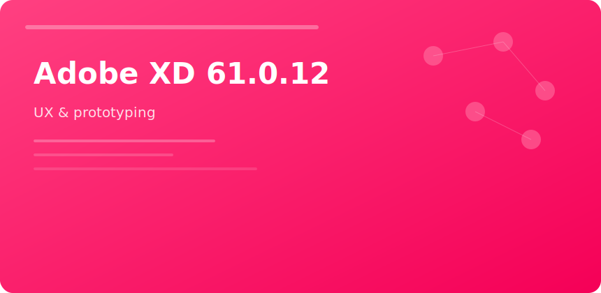

  

  

# Adobe XD 61.0.12

**Scope:** screen design + clickable prototypes + spec export for web/mobile teams.

## Core objects

- Components & states
- Repeat grids for lists
- Auto-animate transitions
- Design tokens via linked assets

## Handoff table

| Deliverable | Method |
|-------------|--------|
| Dev specs | Share link / PDF |
| Assets | SVG/PNG batch export |
| Prototype | Private link with flows |

## v61.0.12

Performance work on large design systems (500+ components) and coediting stability patches.

adobe xd ux ui prototyping wireframe design systems handoff
